# ABD Práctica Cooperativa 3: Usuarios 22/23
## PRÁCTICA TEMA 3: USUARIOS

### Esta práctica ha sido realizada por Alfonso, Felipe e Iván.

## Parte Individual:

## Alumno 1 - Felipe (ORACLE):

#### 1. Crea un rol ROLPRACTICA1 con los privilegios necesarios para conectarse a la base de datos, crear tablas y vistas e insertar datos en la tabla EMP de SCOTT.

#### 2. Crea un usuario USRPRACTICA1 con el tablespace USERS por defecto y averigua que cuota se le ha asignado por defecto en el mismo. Sustitúyela por una cuota de 1M.

#### 3. Modifica el usuario USRPRACTICA1 para que tenga cuota 0 en el tablespace SYSTEM.

#### 4. Concede a USRPRACTICA1 el ROLPRACTICA1.

#### 5. Concede a USRPRACTICA1 el privilegio de crear tablas e insertar datos en el esquema de cualquier usuario. Prueba el privilegio. Comprueba si puede modificar la estructura o eliminar las tablas creadas.

#### 6. Concede a USRPRACTICA1 el privilegio de leer la tabla DEPT de SCOTT con la posibilidad de que lo pase a su vez a terceros usuarios.

#### 7. Comprueba que USRPRACTICA1 puede realizar todas las operaciones previstas en el rol.

#### 8. Quita a USRPRACTICA1 el privilegio de crear vistas. Comprueba que ya no puede hacerlo.

#### 9. Crea un perfil NOPARESDECURRAR que limita a dos el número de minutos de inactividad permitidos en una sesión.

#### 10. Activa el uso de perfiles en ORACLE.

#### 11. Asigna el perfil creado a USRPRACTICA1 y comprueba su correcto funcionamiento.

#### 12. Crea un perfil CONTRASEÑASEGURA especificando que la contraseña caduca mensualmente y sólo se permiten tres intentos fallidos para acceder a la cuenta. En caso de superarse, la cuenta debe quedar bloqueada indefinidamente.

#### 13. Asigna el perfil creado a USRPRACTICA1 y comprueba su funcionamiento. Desbloquea posteriormente al usuario.

#### 14. Consulta qué usuarios existen en tu base de datos.

#### 15. Elige un usuario concreto y consulta qué cuota tiene sobre cada uno de los tablespaces.

#### 16. Elige un usuario concreto y muestra qué privilegios de sistema tiene asignados.

#### 17. Elige un usuario concreto y muestra qué privilegios sobre objetos tiene asignados.

#### 18. Consulta qué roles existen en tu base de datos.

#### 19. Elige un rol concreto y consulta qué usuarios lo tienen asignado.

#### 20. Elige un rol concreto y averigua si está compuesto por otros roles o no.

#### 21. Consulta qué perfiles existen en tu base de datos.

#### 22. Elige un perfil y consulta qué límites se establecen en el mismo.

#### 23. Muestra los nombres de los usuarios que tienen limitado el número de sesiones concurrentes.

#### 24. Realiza un procedimiento que reciba un nombre de usuario y un privilegio de sistema y nos muestre el mensaje 'SI, DIRECTO' si el usuario tiene ese privilegio concedido directamente, 'SI, POR ROL' si el usuario tiene ese privilegio en alguno de los roles que tiene concedidos y un 'NO' si el usuario no tiene dicho privilegio.

#### 25. Realiza un procedimiento llamado MostrarNumSesiones que reciba un nombre de usuario y muestre el número de sesiones concurrentes que puede tener abiertas como máximo y las que tiene abiertas realmente.


## Alumno 2 - Iván (Postgres y ORACLE):

### Postgres:

#### 1. Averigua que privilegios de sistema hay en Postgres y como se asignan a un usuario.

Postgresql utiliza roles para determinar los privilegios de sistema. Estos roles representan usuarios y pueden ser asignados a otros roles.

Para realizar una correcta administración de los privilegios del sistema sobre los usuarios se aconseja agrupar los usuarios en diferentes roles siendo la diferencia principal entre los usuarios y los roles de grupo el privilegio de login que tendrían los primeros.
Se recomienda crear grupos de usuarios a los que se les asigne diferentes privilegios, teniendo en cuenta que sólo los usuarios individuales tendrán permitido el login. 

Estas opciones de configuración pueden ser aplicadas tanto durante la creación del rol como en algún momento posterior, siendo Postgresql capaz de asignar privilegios de manera dinámica a los roles ya existentes:
```sql
    CREATE ROLE <nombre_rol> 
        WITH <opcion>;
    ALTER ROLE <nombre_rol> 
        WITH <opcion>;
```
Ejemplo:
```sql
    CREATE ROLE usuario1 
        WITH CREATEDB 
        LOGIN 
        PASSWORD '1234';
```
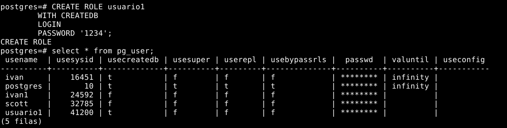

Algunas posibilidades, junto con sus respectivas alternativas, son:

    SUPERUSER/NOSUPERUSER: se agregan los privilegios de superusuario.

    CREATEDB/NOCREATEDB: opción para crear bases de datos.

    CREATEROLE/NOCREATEROLE: opción para crear nuevos roles.

    VALID UNTIL: indica la expiración del rol/usuario.

    [ENCRYPTED] PASSWORD: asigna una contraseña al rol/usuario.

    LOGIN/NOLOGIN: opción para crear sesiones.

    INHERIT/NOINHERIT: opción para determinar si hereda los privilegios de los roles de los que es miembro.

    REPLICATION/NOREPLICATION: opción para controlar la transmisión.

    BYPASSRL/NOBYPASSRLS: opción para omitir los sistemas de seguridad de fila de las tablas.

    CONNECTION LIMIT: limita el número de sesiones concurrentes.

    IN ROLE: opción para indicar los roles de los que formará parte.

    ADMIN: opción para indicar el rol o los roles de los formará parte con derecho a agregar a otros roles en este.


#### 2. Averigua cual es la forma de asignar y revocar privilegios sobre una tabla concreta en Postgres.

Para otorgar privilegios sobre una tabla en Postgres se utilizará una sintaxis particular. Esta consiste en:
```sql
GRANT <nombre_privilegio> 
  ON <nombre_tabla> 
  TO <nombre_rol | nombre_grupo_rol | PUBLIC> 
  [WITH GRANT OPTION]
```
Ejemplo:
```sql
create database db1;
\c db1;
create table tabla1 (id serial primary key, nombre varchar(50));
```
```sql
GRANT SELECT, INSERT 
  ON tabla1 
  TO usuario1
  WITH GRANT OPTION;
```
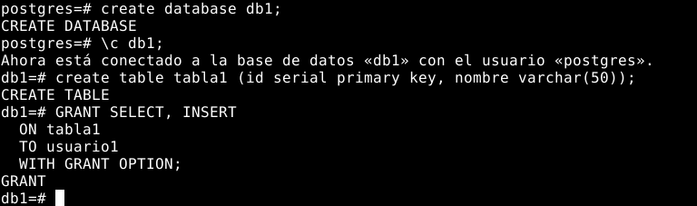

Existen tres roles que pueden otorgar los permisos deseados: 
- Rol superusuario: tiene todos los privilegios sobre todas las tablas.
- Rol propietario de la tabla: tiene todos los privilegios sobre la tabla.
- Rol que ha recibido el privilegio con la opción WITH GRANT OPTION: puede otorgar el privilegio a otros roles.

La estructura para revocar privilegios en una tabla específica es:
```sql
REVOKE <nombre_privilegio> 
  ON <nombre_tabla> 
  FROM <nombre_rol | nombre_grupo_rol | PUBLIC>
```
Ejemplo:
```sql
REVOKE SELECT, INSERT 
  ON tabla1 
  FROM postgres;
```

Además, también se puede quitar la opción WITH GRANT OPTION de un determinado rol de usuario utilizando la orden GRANT OPTION FOR.


#### 3. Averigua si existe el concepto de rol en Postgres y señala las diferencias con los roles de ORACLE.

En Postgres se refiere a los usuarios como roles; a diferencia de ORACLE, donde estos pueden ser grupos de usuarios o/y otros roles. Los roles son los propietarios de las bases de datos en Postgres, y pueden tener otros roles dentro de ellos.

La sintaxis para la creación de roles y la asignación de privilegios sobre los objetos es común entre los dos gestores de base de datos. Esto se hace mediante una secuencia de comandos:
```sql
CREATE ROLE <nombre_rol>;
GRANT <privilegio> 
  ON <nombre_objeto> 
  TO <nombre_rol>;
```
Ejemplo:
```sql
CREATE ROLE usuario2;
GRANT SELECT, INSERT 
  ON tabla1 
  TO usuario2;
```
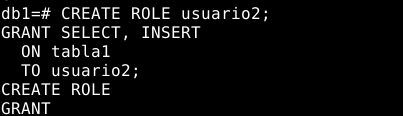

Mientras que la distribución de responsabilidades a otros roles es la misma, Postgres no da soporte a la asignación de roles a un usuario debido a que este concepto no existe.

- Asignación de un rol a un usuario en ORACLE:
```sql
    GRANT <nombre_rol> 
      TO <nombre_usuario>;
```

- Asignación de un rol a otro rol en ORACLE y Postgres:
```sql
GRANT <nombre_rol> 
  TO <nombre_rol>;
```

Para ver los roles y los privilegios de estos en ORACLE, se debe consultar el diccionario de datos al utilizar las vistas DBA_ROLES, DBA_ROLE_PRIVS y ROLE_ROLE_PRIVS. 
En cuanto a Postgres, se recomienda usar el comando \du+ para ver los roles y los privilegios.

Ejemplo:
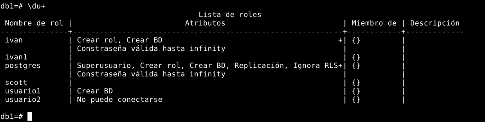

#### 4. Averigua si existe el concepto de perfil como conjunto de límites sobre el uso de recursos o sobre la contraseña en Postgres y señala las diferencias con los perfiles de ORACLE.

En Postgres no hay una noción de perfil, dado que en lugar de trabajar con usuarios como en ORACLE, todas las restricciones se aplican a los objetos. 


#### 5. Realiza consultas al diccionario de datos de Postgres para averiguar todos los privilegios que tiene un usuario concreto.

La sintaxis para consultar todos los privilegios de un usuario en Postgres es:
```sql
select 'Privilegio '||PRIVILEGE_TYPE||
       ' en la tabla '||TABLE_NAME||
       ' del esquema '||TABLE_SCHEMA||
       ' de la base de datos '||TABLE_CATALOG
  from INFORMATION_SCHEMA.TABLE_PRIVILEGES 
  where GRANTEE=<nombre_rol>;
```
Ejemplo 1:
```sql
select 'Privilegio '||PRIVILEGE_TYPE||
       ' en la tabla '||TABLE_NAME||
       ' del esquema '||TABLE_SCHEMA||
       ' de la base de datos '||TABLE_CATALOG
  from INFORMATION_SCHEMA.TABLE_PRIVILEGES 
  where GRANTEE='usuario1';
```
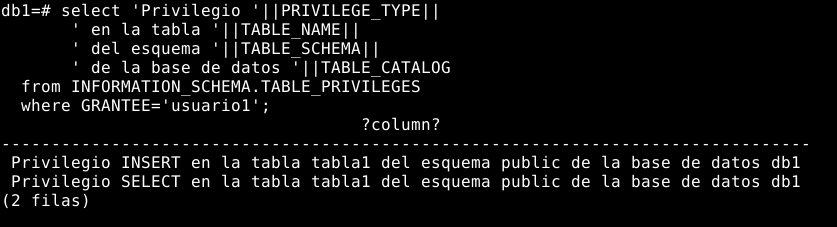
Ejemplo 2:
```sql
select 'Privilegio '||PRIVILEGE_TYPE||
       ' en la tabla '||TABLE_NAME||
       ' del esquema '||TABLE_SCHEMA||
       ' de la base de datos '||TABLE_CATALOG
  from INFORMATION_SCHEMA.TABLE_PRIVILEGES 
  where GRANTEE='scott';
```
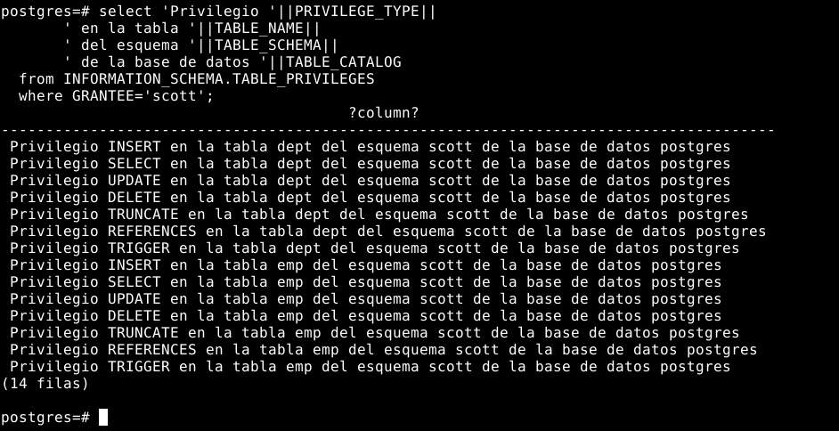

#### 6. Realiza consultas al diccionario de datos en Postgres para averiguar qué usuarios pueden consultar una tabla concreta.

La sintaxis para averiguar qué usuarios pueden consultar una tabla concreta:
```sql
select GRANTEE
  from INFORMATION_SCHEMA.TABLE_PRIVILEGES
  where TABLE_NAME = <nombre_table>
  and PRIVILEGE_TYPE = 'SELECT';
```
Ejemplo 1:
```sql
select GRANTEE
  from INFORMATION_SCHEMA.TABLE_PRIVILEGES
  where TABLE_NAME = 'pg_tables'
  and PRIVILEGE_TYPE = 'SELECT';
```
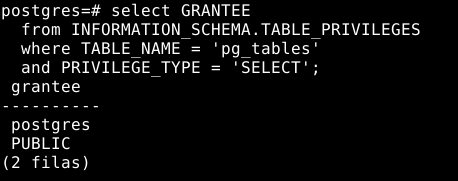

Ejemplo 2:
```sql
select GRANTEE
  from INFORMATION_SCHEMA.TABLE_PRIVILEGES
  where TABLE_NAME = 'emp'
  and PRIVILEGE_TYPE = 'SELECT';
```
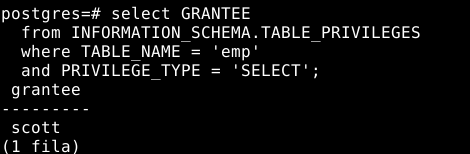

Ejemplo 3:
```sql
select GRANTEE
  from INFORMATION_SCHEMA.TABLE_PRIVILEGES
  where TABLE_NAME = 'tabla1'
  and PRIVILEGE_TYPE = 'SELECT';
```
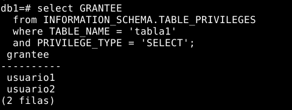

### ORACLE:

#### 7. Realiza una función de verificación de contraseñas que compruebe que la contraseña difiere en más de tres caracteres de la anterior y que la longitud de la misma es diferente de la anterior. Asígnala al perfil CONTRASEÑASEGURA. Comprueba que funciona correctamente.
       
#### 8. Realiza un procedimiento llamado MostrarPrivilegiosdelRol que reciba el nombre de un rol y muestre los privilegios de sistema y los privilegios sobre objetos que lo componen.

```sql
create or replace procedure MostrarPrivilegiosRol (p_rol varchar2)
is
    v_validacion number:=0;
begin
    v_validacion:=f_ComprobarRol(p_rol);
    if v_validacion=0 then
        BuscarPrivilegiosSistema(p_rol);
        dbms_output.put_line(' ');
        dbms_output.put_line('--------------------------------------------------------------------------------');
        dbms_output.put_line(' ');
        BuscarPrivilegiosObjetos(p_rol);
    end if;
end MostrarPrivilegiosRol;
/


create or replace procedure BuscarPrivilegiosSistema(p_rol varchar2)
is
    cursor c_sys
    is
    select distinct privilege
    from role_sys_privs
    where role in (select distinct role 
                   from role_role_privs 
                   start with role=p_rol
                   connect by role = prior granted_role)
    or role = p_rol;
    v_sys c_sys%ROWTYPE;
begin
    dbms_output.put_line('PRIVILEGIOS DEL SISTEMA');
    dbms_output.put_line('--------------------------------------------------------------------------------');
    for v_sys in c_sys loop
        dbms_output.put_line(v_sys.privilege);
    end loop;
end BuscarPrivilegiosSistema;
/


create or replace procedure BuscarPrivilegiosObjetos(p_rol varchar2)
is
    cursor c_tab
    is
    select distinct privilege, table_name, owner
    from role_tab_privs
    where role in (select distinct role 
                   from role_role_privs 
                   start with role=p_rol
                   connect by role = prior granted_role)
    or role = p_rol;
    v_tab c_tab%ROWTYPE;
begin
    dbms_output.put_line('PRIVILEGIOS SOBRE OBJETOS');
    dbms_output.put_line('--------------------------------------------------------------------------------');
    for v_tab in c_tab loop
        dbms_output.put_line(v_tab.privilege||' sobre la tabla '||v_tab.table_name||' del usuario '||v_tab.owner);
    end loop;
end BuscarPrivilegiosObjetos;
/


create or replace function f_ComprobarRol(p_rol varchar2)
return number
is
    v_resultado varchar2(30);
begin
    select role into v_resultado
    from dba_roles
    where role=p_rol;
    return 0;
exception
    when NO_DATA_FOUND then
        dbms_output.put_line('No existe el rol '||p_rol);
        return -1;
end f_ComprobarRol;
/
```
Creación de ROL1 con privilegios sobre el sistema y sobre objetos.
```sql
create role ROL1;
grant create session to ROL1;
grant create table to ROL1;
grant create view to ROL1;
grant create procedure to ROL1;
grant create trigger to ROL1;
grant create database link to ROL1;
grant create sequence to ROL1;
grant create synonym to ROL1;
grant create type to ROL1;
grant select on scott.emp to ROL1;
grant select on scott.dept to ROL1;
```
Comprobación:
- Ejecución del procedimiento sobre un rol que no existe.
```sql
exec MostrarPrivilegiosRol('ROL100');
```
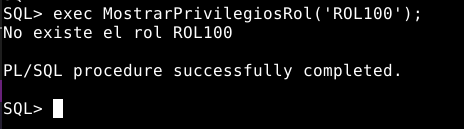

- Ejecución del procedimiento sobre roles existentes.
```sql
exec MostrarPrivilegiosRol('ROL1');
```
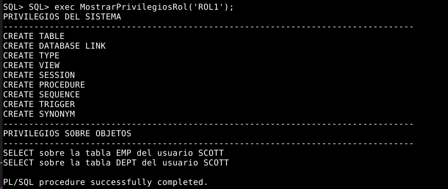

```sql
exec MostrarPrivilegiosRol('ADM_PARALLEL_EXECUTE_TASK');
```
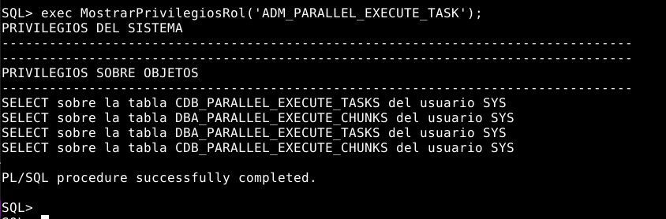

```sql
exec MostrarPrivilegiosRol('DBA');
```
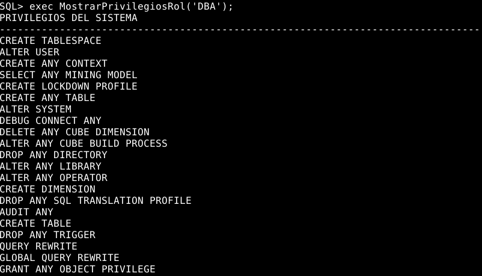
-
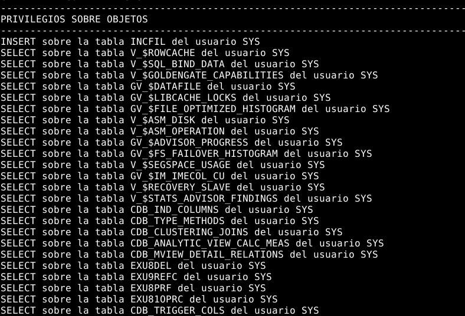

---------------------------------------------------------------------------------------------------------------------------------------------

## Alumno 3 - Alfonso (MySQL y ORACLE):

### MySQL:

#### 1. Averigua que privilegios de sistema hay en MySQL y como se asignan a un usuario.
       
#### 2. Averigua cual es la forma de asignar y revocar privilegios sobre una tabla concreta en MySQL.
       
#### 3. Averigua si existe el concepto de rol en MySQL y señala las diferencias con los roles de ORACLE.
       
#### 4. Averigua si existe el concepto de perfil como conjunto de límites sobre el uso de recursos o sobre la contraseña en MySQL y señala las diferencias con los perfiles de ORACLE.

#### 5. Realiza consultas al diccionario de datos de MySQL para averiguar todos los privilegios que tiene un usuario concreto.

#### 6. Realiza consultas al diccionario de datos en MySQL para averiguar qué usuarios pueden consultar una tabla concreta.


### ORACLE:
       
#### 7. Realiza un procedimiento llamado PermisosdeAsobreB que reciba dos nombres de usuario y muestre los permisos que tiene el primero de ellos sobre objetos del segundo.

#### 8. Realiza un procedimiento llamado MostrarInfoPerfil que reciba el nombre de un perfil y muestre su composición y los usuarios que lo tienen asignado.


## Parte Grupal:

## Alumno 4 (MongoDB y ORACLE):

### MongoDB:

#### 1. Averigua si existe la posibilidad en MongoDB de limitar el acceso de un usuario a los datos de una colección determinada.
       
#### 2. Averigua si en MongoDB existe el concepto de privilegio del sistema y muestra las diferencias más importantes con ORACLE.

#### 3. Explica los roles por defecto que incorpora MongoDB y como se asignan a los usuarios.

#### 4. Explica como puede consultarse el diccionario de datos de MongoDB para saber que roles han sido concedidos a un usuario y qué privilegios incluyen.

### ORACLE:

#### 5. Realiza un procedimiento llamado MostrarObjetosAccesibles que reciba un nombre de usuario y muestre todos los objetos a los que tiene acceso.

#### 6. Realiza un procedimiento que reciba un nombre de usuario, un privilegio y un objeto y nos muestre el mensaje 'SI, DIRECTO' si el usuario tiene ese privilegio sobre objeto concedido directamente, 'SI, POR ROL' si el usuario lo tiene en alguno de los roles que tiene concedidos y un 'NO' si el usuario no tiene dicho privilegio.

## CASO PRÁCTICO 1:

#### 1. (ORACLE, Postgres, MySQL) Crea un usuario llamado Becario y, sin usar los roles de ORACLE, dale los siguientes privilegios: (1,5 puntos)

    • Conectarse a la base de datos.
    
    • Modificar el número de errores en la introducción de la contraseña de cualquier usuario.
    
    • Modificar índices en cualquier esquema (este privilegio podrá pasarlo a quien quiera)
    
    • Insertar filas en scott.emp (este privilegio podrá pasarlo a quien quiera)
    
    • Crear objetos en cualquier tablespace.
    
    • Gestión completa de usuarios, privilegios y roles.

#### 2. (ORACLE, Postgres, MySQL) Escribe una consulta que obtenga un script para quitar el privilegio de borrar registros en alguna tabla de SCOTT a los usuarios que lo tengan.

#### 3. (ORACLE) Crea un tablespace TS2 con tamaño de extensión de 256K. Realiza una consulta que genere un script que asigne ese tablespace como tablespace por defecto a los usuarios que no tienen privilegios para consultar ninguna tabla de SCOTT, excepto a SYSTEM.

#### 4. (ORACLE, Postgres) Realiza un procedimiento que reciba un nombre de usuario y nos muestre cuántas sesiones tiene abiertas en este momento. Además, para cada una de dichas sesiones nos mostrará la hora de comienzo y el nombre de la máquina, sistema operativo y programa desde el que fue abierta.

#### 5. (ORACLE) Realiza un procedimiento que muestre los usuarios que pueden conceder privilegios de sistema a otros usuarios y cuales son dichos privilegios.


## EJERCICIO GRUPAL 3:

### Elaboración de un vídeo grupal resumiendo las diferencias de concepto y en la gestión de usuarios, permisos de sistema y permisos sobre objetos, roles y perfiles entre los cuatro SGBDs estudiados. Cada miembro del grupo hablará de uno de los siguientes temas:

#### a) Usuarios y permisos sobre objetos.

#### b) Permisos de sistema.

#### c) Roles.

#### d) Perfiles.
