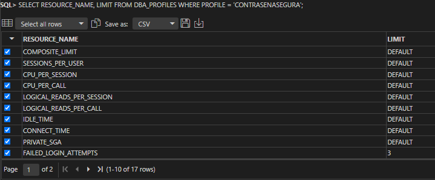
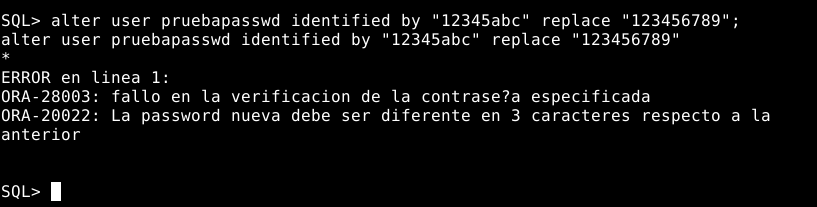
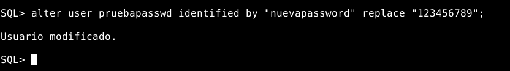
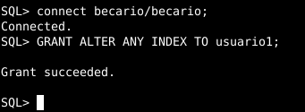
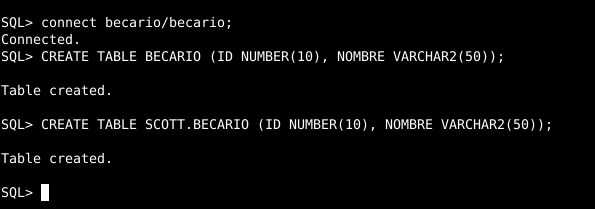

# ABD Práctica Cooperativa 3: Usuarios 22/23
## PRÁCTICA TEMA 3: USUARIOS

### Esta práctica ha sido realizada por Alfonso, Felipe e Iván.

## Parte Individual:

## Alumno 1 - Felipe (ORACLE):

#### 1. Crea un rol ROLPRACTICA1 con los privilegios necesarios para conectarse a la base de datos, crear tablas y vistas e insertar datos en la tabla EMP de SCOTT.

Creación del rol y asignación de permisos.
```sql
    CREATE ROLE ROLPRACTICA1;

    GRANT CONNECT, CREATE VIEW, CREATE TABLE TO ROLPRACTICA1;

	GRANT INSERT ON SCOTT.EMP TO ROLPRACTICA1;
```


#### 2. Crea un usuario USRPRACTICA1 con el tablespace USERS por defecto y averigua que cuota se le ha asignado por defecto en el mismo. Sustitúyela por una cuota de 1M.

Creación del usuario y consulta del tablespace.
```sql
    CREATE USER USRPRACTICA1 IDENTIFIED BY "password" DEFAULT TABLESPACE USERS;

	SELECT USERNAME,BYTES FROM DBA_TS_QUOTAS
	WHERE USERNAME = 'USRPRACTICA1';
```


Cambio de cuota y consulta del tablespace.
```sql
    ALTER USER USRPRACTICA1 QUOTA 1M ON USERS;

    SELECT USERNAME,BYTES FROM DBA_TS_QUOTAS
	WHERE USERNAME = 'USRPRACTICA1';
```


#### 3. Modifica el usuario USRPRACTICA1 para que tenga cuota 0 en el tablespace SYSTEM.

Modificación de cuota en el tablespace SYSTEM.
```sql
    ALTER USER USRPRACTICA1 QUOTA 0 ON SYSTEM;
```


#### 4. Concede a USRPRACTICA1 el ROLPRACTICA1.

Concesión del rol ROLPRACTICA1 al usuario USRPRACTICA1.
```sql
    GRANT ROLPRACTICA1 TO USRPRACTICA1;
```


#### 5. Concede a USRPRACTICA1 el privilegio de crear tablas e insertar datos en el esquema de cualquier usuario. Prueba el privilegio. Comprueba si puede modificar la estructura o eliminar las tablas creadas.

Concesión de privilegios al usuario USRPRACTICA1.
```sql
    GRANT CREATE ANY TABLE, INSERT ANY TABLE TO USRPRACTICA1;
```


Creación de tabla y registro.
```sql
    create table SCOTT.prueba1(
		campo1 varchar2(15),
		campo2 number
	);

    INSERT INTO SCOTT.prueba1 VALUES ('Prueba1',1);
```


Prueba de privilegios.
```sql
	ALTER TABLE SCOTT.prueba1 DROP COLUMN campo2;

	delete from SCOTT.prueba1;

	drop table SCOTT.prueba1;
```


#### 6. Concede a USRPRACTICA1 el privilegio de leer la tabla DEPT de SCOTT con la posibilidad de que lo pase a su vez a terceros usuarios.

Concesión del privilegio y consulta de prueba.
```sql
	GRANT SELECT ON SCOTT.DEPT TO USRPRACTICA1 WITH GRANT OPTION;

	select * from scott.DEPT;
```


#### 7. Comprueba que USRPRACTICA1 puede realizar todas las operaciones previstas en el rol.

Conexión con el usuario usrpractica1.
```sql
	connect USRPRACTICA1;
```


Creación de tabla.
```sql
	create table scott.prueba2 (
		id varchar2(4) not null,
		campo1 varchar2(15),
		campo2 number(8)
	);
```


Creación y consulta sobre la vista.
```sql
	create VIEW vistaprueba AS
	select DNAME from scott.dept;

	select * from VISTAPRUEBA;
```


Añado registro a la tabla emp de scott.
```sql
	insert into scott.emp values(9501, 'Pepe', 'test', 8251, TO_DATE('16-JAN-2023', 'DD-MON-YYYY'),950, null, 20);
```


#### 8. Quita a USRPRACTICA1 el privilegio de crear vistas. Comprueba que ya no puede hacerlo.

Eliminación del privilegio de crear vistas del usuario usrpractica1 y prueba de funcionamiento.
```sql
	REVOKE CREATE VIEW FROM ROLPRACTICA1;

    create VIEW vistaprueba1 AS
	select DNAME,LOC from scott.dept;
```


#### 9. Crea un perfil NOPARESDECURRAR que limita a dos el número de minutos de inactividad permitidos en una sesión.

Creación del perfil NOPARESDECURRAR.
```sql
	CREATE PROFILE NOPARESDECURRAR LIMIT IDLE_TIME 2;
```


#### 10. Activa el uso de perfiles en ORACLE.

Activación de perfiles en Oracle.
```sql
	ALTER SYSTEM SET RESOURCE_LIMIT = TRUE;
```


#### 11. Asigna el perfil creado a USRPRACTICA1 y comprueba su correcto funcionamiento.

Asignación del perfil NOPARESDECURRAR al usuario usrpractica1.
```sql
	ALTER USER USRPRACTICA1 PROFILE NOPARESDECURRAR;
```


#### 12. Crea un perfil CONTRASEÑASEGURA especificando que la contraseña caduca mensualmente y sólo se permiten tres intentos fallidos para acceder a la cuenta. En caso de superarse, la cuenta debe quedar bloqueada indefinidamente.

Cración del perfil CONTRASEÑASEGURA.
```sql
	CREATE PROFILE contrasenasegura LIMIT
		PASSWORD_LIFE_TIME 30
		FAILED_LOGIN_ATTEMPTS 3
		PASSWORD_REUSE_TIME UNLIMITED
		PASSWORD_REUSE_MAX UNLIMITED;
```


#### 13. Asigna el perfil creado a USRPRACTICA1 y comprueba su funcionamiento. Desbloquea posteriormente al usuario.

Asignación del perfil CONTRASEÑASEGURA al usuario usrpractica1.
```sql
	ALTER USER USRPRACTICA1 PROFILE contrasenasegura;
```


Pruebas de funcionamiento.
```sql
	connect USRPRACTICA1;
```


```sql
		ALTER USER USRPRACTICA1 ACCOUNT UNLOCK;
```


#### 14. Consulta qué usuarios existen en tu base de datos.

Consulta de usuarios en la base de datos.
```sql
	SELECT username FROM dba_users;
```


#### 15. Elige un usuario concreto y consulta qué cuota tiene sobre cada uno de los tablespaces.

Cuota de usuario concreto sobre tablespaces.
```sql
	SELECT username,tablespace_name, bytes FROM dba_ts_quotas
	WHERE username = 'SCOTT';
```


#### 16. Elige un usuario concreto y muestra qué privilegios de sistema tiene asignados.

Privilegios de sistema en usuario concreto.
```sql
	SELECT * FROM DBA_SYS_PRIVS WHERE GRANTEE = 'SYS';
```


#### 17. Elige un usuario concreto y muestra qué privilegios sobre objetos tiene asignados.

Privilegios sobre objetos en usuario concreto.
```sql
	SELECT * FROM DBA_TAB_PRIVS WHERE GRANTEE = 'SYS';
```


#### 18. Consulta qué roles existen en tu base de datos.

Roles existentes en la base de datos.
```sql
	SELECT ROLE FROM DBA_ROLES;
```


#### 19. Elige un rol concreto y consulta qué usuarios lo tienen asignado.

Consulta de usuarios que poseen un rol concreto.
```sql
	SELECT GRANTEE FROM DBA_ROLE_PRIVS WHERE GRANTED_ROLE = 'CONNECT';
```


#### 20. Elige un rol concreto y averigua si está compuesto por otros roles o no.

Consulta sobre composición de roles.
```sql
	SELECT granted_role FROM dba_role_privs WHERE grantee = 'RESOURCE';
```


#### 21. Consulta qué perfiles existen en tu base de datos.

Perfiles existentes en la base de datos.
```sql
	SELECT RESOURCE_NAME FROM DBA_PROFILES;
```


#### 22. Elige un perfil y consulta qué límites se establecen en el mismo.

Consulta limites definido en perfil.
```sql
	SELECT RESOURCE_NAME, LIMIT FROM DBA_PROFILES WHERE PROFILE = 'CONTRASENASEGURA';
```


#### 23. Muestra los nombres de los usuarios que tienen limitado el número de sesiones concurrentes.

Usuarios con sesiones limitadas.
```sql
	 CREATE PROFILE LIMITE_SESIONES LIMIT SESSIONS_PER_USER 5;

    ALTER USER SCOTT PROFILE LIMITE_SESIONES;

	SELECT username, resource_name, limit FROM dba_profiles JOIN dba_users USING (profile) WHERE resource_name = 'SESSIONS_PER_USER' AND limit != 'UNLIMITED' AND limit != 'DEFAULT';
```


#### 24. Realiza un procedimiento que reciba un nombre de usuario y un privilegio de sistema y nos muestre el mensaje 'SI, DIRECTO' si el usuario tiene ese privilegio concedido directamente, 'SI, POR ROL' si el usuario tiene ese privilegio en alguno de los roles que tiene concedidos y un 'NO' si el usuario no tiene dicho privilegio.

#### 25. Realiza un procedimiento llamado MostrarNumSesiones que reciba un nombre de usuario y muestre el número de sesiones concurrentes que puede tener abiertas como máximo y las que tiene abiertas realmente.

Procedimiento MostrarNumSesiones.
```sql
	CREATE OR REPLACE PROCEDURE MostrarNumSesiones (user IN VARCHAR2) 
	IS
	v_perfil VARCHAR2(30);
	v_limitmaxsesiones VARCHAR2(40);
	v_numsesiones NUMBER;

	BEGIN
		SELECT PROFILE INTO v_perfil FROM DBA_USERS where username = user;

		select limit INTO v_limitmaxsesiones from DBA_PROFILES CDB_PROFILES
		where profile = v_perfil AND RESOURCE_NAME = 'SESSIONS_PER_USER';

		select count(username) INTO v_numsesiones from V$session where username =user;

		dbms_output.put_line('El limite de sesiones concurrentes permitidas del usuario '|| user || ' es : ' || v_limitmaxsesiones);
		dbms_output.put_line('El número real de sesiones que tiene abiertas son: '|| v_numsesiones); 	END;
	/
```
Ejecución de procedimiento MostrarNumSesiones.
```sql
    execute MostrarNumSesiones('SYS');
```


---------------------------------------------------------------------------------------------------------------------------------------------

## Alumno 2 - Iván (Postgres y ORACLE):

### Postgres:

#### 1. Averigua que privilegios de sistema hay en Postgres y como se asignan a un usuario.

Postgresql utiliza roles para determinar los privilegios de sistema. Estos roles representan usuarios y pueden ser asignados a otros roles.

Para realizar una correcta administración de los privilegios del sistema sobre los usuarios se aconseja agrupar los usuarios en diferentes roles siendo la diferencia principal entre los usuarios y los roles de grupo el privilegio de login que tendrían los primeros.
Se recomienda crear grupos de usuarios a los que se les asigne diferentes privilegios, teniendo en cuenta que sólo los usuarios individuales tendrán permitido el login. 

Estas opciones de configuración pueden ser aplicadas tanto durante la creación del rol como en algún momento posterior, siendo Postgresql capaz de asignar privilegios de manera dinámica a los roles ya existentes:
```sql
    CREATE ROLE <nombre_rol> 
        WITH <opcion>;
    ALTER ROLE <nombre_rol> 
        WITH <opcion>;
```
Ejemplo:
```sql
    CREATE ROLE usuario1 
        WITH CREATEDB 
        LOGIN 
        PASSWORD '1234';
```


Algunas posibilidades, junto con sus respectivas alternativas, son:

    SUPERUSER/NOSUPERUSER: se agregan los privilegios de superusuario.

    CREATEDB/NOCREATEDB: opción para crear bases de datos.

    CREATEROLE/NOCREATEROLE: opción para crear nuevos roles.

    VALID UNTIL: indica la expiración del rol/usuario.

    [ENCRYPTED] PASSWORD: asigna una contraseña al rol/usuario.

    LOGIN/NOLOGIN: opción para crear sesiones.

    INHERIT/NOINHERIT: opción para determinar si hereda los privilegios de los roles de los que es miembro.

    REPLICATION/NOREPLICATION: opción para controlar la transmisión.

    BYPASSRL/NOBYPASSRLS: opción para omitir los sistemas de seguridad de fila de las tablas.

    CONNECTION LIMIT: limita el número de sesiones concurrentes.

    IN ROLE: opción para indicar los roles de los que formará parte.

    ADMIN: opción para indicar el rol o los roles de los formará parte con derecho a agregar a otros roles en este.

---------------------------------------------------------------------------------------------------------------------------------------------

#### 2. Averigua cual es la forma de asignar y revocar privilegios sobre una tabla concreta en Postgres.

Para otorgar privilegios sobre una tabla en Postgres se utilizará una sintaxis particular. Esta consiste en:
```sql
GRANT <nombre_privilegio> 
  ON <nombre_tabla> 
  TO <nombre_rol | nombre_grupo_rol | PUBLIC> 
  [WITH GRANT OPTION]
```
Ejemplo:
```sql
create database db1;
\c db1;
create table tabla1 (id serial primary key, nombre varchar(50));
```
```sql
GRANT SELECT, INSERT 
  ON tabla1 
  TO usuario1
  WITH GRANT OPTION;
```


Existen tres roles que pueden otorgar los permisos deseados: 
- Rol superusuario: tiene todos los privilegios sobre todas las tablas.
- Rol propietario de la tabla: tiene todos los privilegios sobre la tabla.
- Rol que ha recibido el privilegio con la opción WITH GRANT OPTION: puede otorgar el privilegio a otros roles.

La estructura para revocar privilegios en una tabla específica es:
```sql
REVOKE <nombre_privilegio> 
  ON <nombre_tabla> 
  FROM <nombre_rol | nombre_grupo_rol | PUBLIC>
```
Ejemplo:
```sql
REVOKE SELECT, INSERT 
  ON tabla1 
  FROM postgres;
```

Además, también se puede quitar la opción WITH GRANT OPTION de un determinado rol de usuario utilizando la orden GRANT OPTION FOR.

---------------------------------------------------------------------------------------------------------------------------------------------

#### 3. Averigua si existe el concepto de rol en Postgres y señala las diferencias con los roles de ORACLE.

En Postgres se refiere a los usuarios como roles; a diferencia de ORACLE, donde estos pueden ser grupos de usuarios o/y otros roles. Los roles son los propietarios de las bases de datos en Postgres, y pueden tener otros roles dentro de ellos.

La sintaxis para la creación de roles y la asignación de privilegios sobre los objetos es común entre los dos gestores de base de datos. Esto se hace mediante una secuencia de comandos:
```sql
CREATE ROLE <nombre_rol>;
GRANT <privilegio> 
  ON <nombre_objeto> 
  TO <nombre_rol>;
```
Ejemplo:
```sql
CREATE ROLE usuario2;
GRANT SELECT, INSERT 
  ON tabla1 
  TO usuario2;
```


Mientras que la distribución de responsabilidades a otros roles es la misma, Postgres no da soporte a la asignación de roles a un usuario debido a que este concepto no existe.

- Asignación de un rol a un usuario en ORACLE:
```sql
    GRANT <nombre_rol> 
      TO <nombre_usuario>;
```

- Asignación de un rol a otro rol en ORACLE y Postgres:
```sql
GRANT <nombre_rol> 
  TO <nombre_rol>;
```

Para ver los roles y los privilegios de estos en ORACLE, se debe consultar el diccionario de datos al utilizar las vistas DBA_ROLES, DBA_ROLE_PRIVS y ROLE_ROLE_PRIVS. 
En cuanto a Postgres, se recomienda usar el comando \du+ para ver los roles y los privilegios.

Ejemplo:


---------------------------------------------------------------------------------------------------------------------------------------------

#### 4. Averigua si existe el concepto de perfil como conjunto de límites sobre el uso de recursos o sobre la contraseña en Postgres y señala las diferencias con los perfiles de ORACLE.

En Postgres no hay una noción de perfil, dado que en lugar de trabajar con usuarios como en ORACLE, todas las restricciones se aplican a los objetos. 

---------------------------------------------------------------------------------------------------------------------------------------------

#### 5. Realiza consultas al diccionario de datos de Postgres para averiguar todos los privilegios que tiene un usuario concreto.

La sintaxis para consultar todos los privilegios de un usuario en Postgres es:
```sql
select 'Privilegio '||PRIVILEGE_TYPE||
       ' en la tabla '||TABLE_NAME||
       ' del esquema '||TABLE_SCHEMA||
       ' de la base de datos '||TABLE_CATALOG
  from INFORMATION_SCHEMA.TABLE_PRIVILEGES 
  where GRANTEE=<nombre_rol>;
```
Ejemplo 1:
```sql
select 'Privilegio '||PRIVILEGE_TYPE||
       ' en la tabla '||TABLE_NAME||
       ' del esquema '||TABLE_SCHEMA||
       ' de la base de datos '||TABLE_CATALOG
  from INFORMATION_SCHEMA.TABLE_PRIVILEGES 
  where GRANTEE='usuario1';
```

Ejemplo 2:
```sql
select 'Privilegio '||PRIVILEGE_TYPE||
       ' en la tabla '||TABLE_NAME||
       ' del esquema '||TABLE_SCHEMA||
       ' de la base de datos '||TABLE_CATALOG
  from INFORMATION_SCHEMA.TABLE_PRIVILEGES 
  where GRANTEE='scott';
```


---------------------------------------------------------------------------------------------------------------------------------------------

#### 6. Realiza consultas al diccionario de datos en Postgres para averiguar qué usuarios pueden consultar una tabla concreta.

La sintaxis para averiguar qué usuarios pueden consultar una tabla concreta:
```sql
select GRANTEE
  from INFORMATION_SCHEMA.TABLE_PRIVILEGES
  where TABLE_NAME = <nombre_table>
  and PRIVILEGE_TYPE = 'SELECT';
```
Ejemplo 1:
```sql
select GRANTEE
  from INFORMATION_SCHEMA.TABLE_PRIVILEGES
  where TABLE_NAME = 'pg_tables'
  and PRIVILEGE_TYPE = 'SELECT';
```


Ejemplo 2:
```sql
select GRANTEE
  from INFORMATION_SCHEMA.TABLE_PRIVILEGES
  where TABLE_NAME = 'emp'
  and PRIVILEGE_TYPE = 'SELECT';
```


Ejemplo 3:
```sql
select GRANTEE
  from INFORMATION_SCHEMA.TABLE_PRIVILEGES
  where TABLE_NAME = 'tabla1'
  and PRIVILEGE_TYPE = 'SELECT';
```


---------------------------------------------------------------------------------------------------------------------------------------------

### ORACLE:

#### 7. Realiza una función de verificación de contraseñas que compruebe que la contraseña difiere en más de tres caracteres de la anterior y que la longitud de la misma es diferente de la anterior. Asígnala al perfil CONTRASEÑASEGURA. Comprueba que funciona correctamente.

```sql
create or replace function f_verificar_passwd (p_usuario in varchar2, p_nueva_passwd in varchar2, p_vieja_passwd in varchar2)
return boolean
is
    v_sumaRepe number:=0;
    v_letraigual number:=0;
    v_numNum number:=0;
    v_numLetra number:=0;
    v_validar number:=0;
begin
    if length(p_nueva_passwd)=length(p_vieja_passwd) then
        raise_application_error(-20020, 'La password nueva no debe ser de la misma longitud que la anterior.');
    end if;
    for i in 1..length(p_nueva_passwd) loop
        ContarNumerosYLetras(substr(p_nueva_passwd, i,1), v_numNum, v_numLetra);
        CompararCaracteres(substr(p_nueva_passwd, i,1), p_vieja_passwd, v_letraigual);
        if v_letraigual=0 then
            v_sumaRepe:=v_sumaRepe+1;
        end if;
        v_letraigual:=0; 
    end loop;
    v_validar:=f_errores(v_sumaRepe, v_numNum, v_numLetra);
    return TRUE;
end f_verificar_passwd;
/

create or replace function f_errores(p_sumaRepe number, p_numNum number, p_numLetra number)
return number
is
begin
    case
        when p_sumaRepe<4 then
            raise_application_error(-20022, 'La password nueva debe ser diferente en 3 caracteres respecto a la anterior');
        else
            return 1;
    end case;       
end f_errores;
/


create or replace procedure CompararCaracteres(p_caracter varchar2, p_passwd varchar2, p_letraigual in out number)
is
begin
    for i in 1..length(p_passwd) loop
        if substr(p_passwd,i,1)=p_caracter then
            p_letraigual:=1;
        end if;
    end loop;
end CompararCaracteres;
/


create or replace procedure ContarNumerosYLetras (p_caracter varchar2, p_numero in out number, p_letra in out number)
is
begin
    if p_caracter=REGEXP_REPLACE(p_caracter,'[0-9]') then
        p_numero:=p_numero+1;
    else
        p_letra:=p_letra+1;
    end if;
end ContarNumerosYLetras;
/
```

Creación de perfil.
```sql
create profile CONTRASENASEGURA limit PASSWORD_VERIFY_FUNCTION f_verificar_passwd;
```


Creación de usuario con contraseña.
```sql
create user pruebapasswd identified by "123456789";
grant connect, resource to pruebapasswd;
```


Cambio de contraseña por una no válida antes de asignar el perfil.
```sql
alter user pruebapasswd identified by "123456789" replace "123456789";
```


Asignación del perfil al usuario.
```sql
alter user pruebapasswd profile CONTRASENASEGURA;
```


IMPORTANTE: Se debe loguear con el usuario pruebapasswd para que se ejecute la función de verificación de contraseñas.
```sql
connect pruebapasswd/123456789;
```

Cambio de contraseña por una no válida después de asignar el perfil:
- La contraseña no es válida porque es igual a la anterior.
```sql
alter user pruebapasswd identified by "123456789" replace "123456789";
```


- La contraseña no es válida porque es de la misma longitud que la anterior.
```sql
alter user pruebapasswd identified by "ASDFGHJKL" replace "123456789";
```


- La contraseña no es válida porque no difiere en 3 caracteres de la anterior.
```sql
alter user pruebapasswd identified by "12345abc" replace "123456789";
```


La contraseña es válida.
```sql
alter user pruebapasswd identified by "nuevapassword" replace "123456789";
```


---------------------------------------------------------------------------------------------------------------------------------------------

#### 8. Realiza un procedimiento llamado MostrarPrivilegiosdelRol que reciba el nombre de un rol y muestre los privilegios de sistema y los privilegios sobre objetos que lo componen.

```sql
create or replace procedure MostrarPrivilegiosRol (p_rol varchar2)
is
    v_validacion number:=0;
begin
    v_validacion:=f_ComprobarRol(p_rol);
    if v_validacion=0 then
        BuscarPrivilegiosSistema(p_rol);
        dbms_output.put_line(' ');
        dbms_output.put_line('--------------------------------------------------------------------------------');
        dbms_output.put_line(' ');
        BuscarPrivilegiosObjetos(p_rol);
    end if;
end MostrarPrivilegiosRol;
/


create or replace procedure BuscarPrivilegiosSistema(p_rol varchar2)
is
    cursor c_sys
    is
    select distinct privilege
    from role_sys_privs
    where role in (select distinct role 
                   from role_role_privs 
                   start with role=p_rol
                   connect by role = prior granted_role)
    or role = p_rol;
    v_sys c_sys%ROWTYPE;
begin
    dbms_output.put_line('PRIVILEGIOS DEL SISTEMA');
    dbms_output.put_line('--------------------------------------------------------------------------------');
    for v_sys in c_sys loop
        dbms_output.put_line(v_sys.privilege);
    end loop;
end BuscarPrivilegiosSistema;
/


create or replace procedure BuscarPrivilegiosObjetos(p_rol varchar2)
is
    cursor c_tab
    is
    select distinct privilege, table_name, owner
    from role_tab_privs
    where role in (select distinct role 
                   from role_role_privs 
                   start with role=p_rol
                   connect by role = prior granted_role)
    or role = p_rol;
    v_tab c_tab%ROWTYPE;
begin
    dbms_output.put_line('PRIVILEGIOS SOBRE OBJETOS');
    dbms_output.put_line('--------------------------------------------------------------------------------');
    for v_tab in c_tab loop
        dbms_output.put_line(v_tab.privilege||' sobre la tabla '||v_tab.table_name||' del usuario '||v_tab.owner);
    end loop;
end BuscarPrivilegiosObjetos;
/


create or replace function f_ComprobarRol(p_rol varchar2)
return number
is
    v_resultado varchar2(30);
begin
    select role into v_resultado
    from dba_roles
    where role=p_rol;
    return 0;
exception
    when NO_DATA_FOUND then
        dbms_output.put_line('No existe el rol '||p_rol);
        return -1;
end f_ComprobarRol;
/
```
Creación de ROL1 con privilegios sobre el sistema y sobre objetos.
```sql
create role ROL1;
grant create session to ROL1;
grant create table to ROL1;
grant create view to ROL1;
grant create procedure to ROL1;
grant create trigger to ROL1;
grant create database link to ROL1;
grant create sequence to ROL1;
grant create synonym to ROL1;
grant create type to ROL1;
grant select on scott.emp to ROL1;
grant select on scott.dept to ROL1;
```
Comprobación:
- Ejecución del procedimiento sobre un rol que no existe.
```sql
exec MostrarPrivilegiosRol('ROL100');
```


- Ejecución del procedimiento sobre roles existentes.
```sql
exec MostrarPrivilegiosRol('ROL1');
```


```sql
exec MostrarPrivilegiosRol('ADM_PARALLEL_EXECUTE_TASK');
```


```sql
exec MostrarPrivilegiosRol('DBA');
```

-


---------------------------------------------------------------------------------------------------------------------------------------------

## Alumno 3 - Alfonso (MySQL y ORACLE):

### MySQL:

#### 1. Averigua que privilegios de sistema hay en MySQL y como se asignan a un usuario.
       
#### 2. Averigua cual es la forma de asignar y revocar privilegios sobre una tabla concreta en MySQL.
       
#### 3. Averigua si existe el concepto de rol en MySQL y señala las diferencias con los roles de ORACLE.
       
#### 4. Averigua si existe el concepto de perfil como conjunto de límites sobre el uso de recursos o sobre la contraseña en MySQL y señala las diferencias con los perfiles de ORACLE.

#### 5. Realiza consultas al diccionario de datos de MySQL para averiguar todos los privilegios que tiene un usuario concreto.

#### 6. Realiza consultas al diccionario de datos en MySQL para averiguar qué usuarios pueden consultar una tabla concreta.


### ORACLE:
       
#### 7. Realiza un procedimiento llamado PermisosdeAsobreB que reciba dos nombres de usuario y muestre los permisos que tiene el primero de ellos sobre objetos del segundo.

#### 8. Realiza un procedimiento llamado MostrarInfoPerfil que reciba el nombre de un perfil y muestre su composición y los usuarios que lo tienen asignado.


## Parte Grupal:

## Alumno 4 (MongoDB y ORACLE):

### MongoDB:

#### 1. Averigua si existe la posibilidad en MongoDB de limitar el acceso de un usuario a los datos de una colección determinada.

Se puede realizar mediante el uso de roles.

Ejemplo:

Creamos un nuevo rol con permisos de lectura solo para la colección "collection1" en la base de datos "dbprueba".

```mongo
    db.createRole({
        role: "rol1",
        privileges: [
            { resource: { db: "dbprueba", collection: "collection1" }, actions: [ "find" ] }
        ],
        roles: []
    })
```

Asignamos el rol a un usuario y de esta manera estaria restringido el acceso al resto de colecciones.

```mongo
    db.grantRolesToUser("prueba", [ "rol1" ])
```

#### 2. Averigua si en MongoDB existe el concepto de privilegio del sistema y muestra las diferencias más importantes con ORACLE.

Oracle tiene dos tipos de privilegios para el usuario:

System:

	Permite al usuario realizar tareas administrativas.

Object:

	En este caso le permite al usuario crear algunos objetos en la base de datos, como tabla, vista, función…


En el caso de MongoDB no tenemos esos permisos si no roles

Un rol es un conjunto de privilegios.

Un privilegio define una acción o acciones que se puede realizar sobre un recurso

Los recursos

	Bases de datos
	Colecciones
	Conjunto de colecciones
	Nivel de cluster: representa operaciones sobre el conjunto de réplica o el cluster de shards

Un rol puede heredar privilegios de otros roles

Tipos de roles

	Roles predefinidos del sistema: son los que ya se encuentran creados por el sistema

	Roles definidos por el usuario: son los creados por el administrador del sistema

#### 3. Explica los roles por defecto que incorpora MongoDB y como se asignan a los usuarios.

-read: permite leer datos de todas las colecciones.

-readWrite: permite leer y escribir datos de todas las colecciones.

-dbAdmin: permite realizar tareas administrativas.

-userAdmin: permite crear y modificar usuarios y roles en la base de datos actual

-dbOwner: puede efectuar cualquier operación administrativa en la base de datos. Por lo tanto, junta los privilegios de readWrite, dbAdmin y userAdmin.

-clusterMonitor: permite acceso de solo lectura a las herramientas de supervisión.

-clusterManager: permite realizar acciones de administración y monitorización en el cluster.

-hostManager: permite monitorizar y administrar servidores.

-clusterAdmin: combina los tres roles anteriores, añadiendo además el rol dropDatabase.

-backup: permite realizar copias de seguridad de los datos.

-restore: permite restaurar los datos de las copias de seguridad.


-Roles de superusuarios
	userAdmin
	dbOwner
	userAdminAnyDatabase
	root: asigna privilegios completos sobre todos los recursos del sistema.

-Roles de todas las bases de datos
	-readAnyDatabase: es el mismo rol que read pero se aplica a todas las bases de datos.
	-readWriteAnyDatabase: es el mismo rol que readWrite pero se aplica a todas las bases de datos.
	-userAdminAnyDatabase: es el mismo rol que userAdmin pero se aplica a todas las bases de datos.
	-dbAdminAnyDatabase: es el mismo rol que dbAdmin pero se aplica a todas las bases de datos.

Cuando estamos creando el usuario:
```mongo
db.createUser( {user: "USUARIO", pwd: "PASS", roles: [ { role: "NOMBRE DEL ROL", db: "DB" } ] })
```

Cuando ya está creado el usuario:
```mongo
db.grantRolesToUser( "USUARIO", [ { role : "NOMBRE DEL ROL", db : "DB" }, "NOMBRE DEL ROL", … ])
```

#### 4. Explica como puede consultarse el diccionario de datos de MongoDB para saber que roles han sido concedidos a un usuario y qué privilegios incluyen.

Para poder ver los roles que tiene un usuario sobre una base de datos primero tenemos que seleccionar la base de datos.

```mongo
    use test
```

Y para consultar los roles que tiene usamos la siguiente instrucción:

```mongo
    db.getUser("nombre-usuario")
```

Para ver los privilegios que tiene un rol usamos la siguiente instrucción:

```mongo
    db.getRole("role_name")
```

### ORACLE:

#### 5. Realiza un procedimiento llamado MostrarObjetosAccesibles que reciba un nombre de usuario y muestre todos los objetos a los que tiene acceso.

#### 6. Realiza un procedimiento que reciba un nombre de usuario, un privilegio y un objeto y nos muestre el mensaje 'SI, DIRECTO' si el usuario tiene ese privilegio sobre objeto concedido directamente, 'SI, POR ROL' si el usuario lo tiene en alguno de los roles que tiene concedidos y un 'NO' si el usuario no tiene dicho privilegio.

## CASO PRÁCTICO 1:

#### 1. (ORACLE, Postgres, MySQL) Crea un usuario llamado Becario y, sin usar los roles de ORACLE, dale los siguientes privilegios: (1,5 puntos)

    • Conectarse a la base de datos.
    
    • Modificar el número de errores en la introducción de la contraseña de cualquier usuario.
    
    • Modificar índices en cualquier esquema (este privilegio podrá pasarlo a quien quiera)
    
    • Insertar filas en scott.emp (este privilegio podrá pasarlo a quien quiera)
    
    • Crear objetos en cualquier tablespace.
    
    • Gestión completa de usuarios, privilegios y roles.
    
---------------------------------------------------------------------------------------------------------------------------------------------

#### VERSIÓN ORACLE:
Creación el usuario becario
```sql 
CREATE USER becario IDENTIFIED BY becario;
```
Asignación de privilegios para conectarse a la base de datos
```sql
GRANT CREATE SESSION TO becario;
```
- Comprobación de inicio de sesión:
```sql
connect becario/becario;
```


Modificación del número de errores en la introducción de la contraseña de cualquier usuario:

- Creamos el perfil que defina los límites en este caso hasta 5 intentos:
```sql
CREATE PROFILE limitpass LIMIT FAILED_LOGIN_ATTEMPTS 5;
```


- Le damos al usuario becarios la posibilidad de dar dicho perfil:
```sql
GRANT ALTER USER TO becario;
alter user becario profile limitpass;
```


- Ahora asignamos el perfil del usuario mediante ALTER USER para que use dicho perfil, en este caso el usuario becario y el usuario usuario1:
```sql
connect becario/becario;
ALTER USER becario PROFILE limitpass;
ALTER USER usuario1 PROFILE limitpass;
```


- Comprobación de cuantos intentos de conexión tiene el usuario becario:


- Comprobación de cuantos intentos de conexión tiene el usuario usuario1:


- Vamos a hacer una consulta para ver los usuarios que tienen el perfil bloqueado:
```sql
SELECT USERNAME, ACCOUNT_STATUS FROM DBA_USERS WHERE USERNAME = 'BECARIO' OR USERNAME = 'USUARIO1';
```


- Vamos a desbloquear el perfil del usuario becario:
```sql
ALTER USER BECARIO ACCOUNT UNLOCK;
```


Modificación de índices en cualquier esquema (este privilegio podrá pasarlo a quien quiera):
```sql
GRANT ALTER ANY INDEX TO becario WITH ADMIN OPTION;
```


- Haremos que se lo pase a otro usuario:
```sql
connect becario/becario;
GRANT ALTER ANY INDEX TO usuario1;
```


- Ver los indices:
```sql
SELECT INDEX_NAME, TABLE_OWNER, TABLE_NAME FROM ALL_INDEXES WHERE TABLE_OWNER = 'SCOTT';
```
Vemos que en la tabla emp hay un índice llamado PK_EMP y otro en la tabla dept llamado PK_DEPT.


- Comprobación de que el usuario becario puede modificar índices en la tabla emp:
```sql
connect becario/becario;
ALTER INDEX SCOTT.PK_EMP RENAME TO PK_EMP_BECARIO;
ALTER INDEX SCOTT.PK_EMP_BECARIO RENAME TO PK_EMP;
```


- Como superusuario, comprobamos que el índice se ha renombrado:
```sql
SELECT INDEX_NAME, TABLE_OWNER, TABLE_NAME FROM ALL_INDEXES WHERE TABLE_OWNER = 'SCOTT';
```


Insertar filas en scott.emp (este privilegio podrá pasarlo a quien quiera):
```sql
GRANT INSERT ON SCOTT.EMP TO becario with GRANT OPTION;
```


- Haremos que se lo pase a otro usuario:
```sql
connect becario/becario;
GRANT INSERT ON SCOTT.EMP TO usuario1;
```


- Comprobación de que el usuario becario puede insertar en la tabla emp:
```sql
connect becario/becario;
INSERT INTO SCOTT.EMP VALUES (9999, 'BECARIO', 'ANALISTA', 7839, SYSDATE, 5000, NULL, 10);
```


- Comprobación de que el usuario usuario1 puede insertar en la tabla emp:
```sql
connect usuario1/usuario1;
INSERT INTO SCOTT.EMP VALUES (9998, 'USUARIO1', 'ANALISTA', 7839, SYSDATE, 5000, NULL, 10);
```


- Consulta de la tabla emp para comprobar que se han insertado los registros:
```sql
SELECT * FROM SCOTT.EMP WHERE EMPNO = 9999 OR EMPNO = 9998;
```


Crear objetos en cualquier tablespace:
```sql
GRANT UNLIMITED TABLESPACE TO becario;
GRANT CREATE ANY TABLE TO becario;
```


- Comprobación de que el usuario becario puede crear objetos en cualquier tablespace:
```sql
connect becario/becario;
CREATE TABLE BECARIO (ID NUMBER(10), NOMBRE VARCHAR2(50));
CREATE TABLE SCOTT.BECARIO (ID NUMBER(10), NOMBRE VARCHAR2(50));
```


Gestión completa de usuarios, privilegios y roles:
- Gestión de usuarios:
```sql
GRANT CREATE USER TO becario;
GRANT BECOME USER TO becario;
GRANT ALTER USER TO becario;
GRANT DROP USER TO becario;
```


- Gestión de privilegios:
```sql
GRANT ALL PRIVILEGES TO becario;
```


- Gestión de roles:
```sql
GRANT CREATE ROLE TO becario;
GRANT ALTER ANY ROLE TO becario;
GRANT DROP ANY ROLE TO becario;
GRANT GRANT ANY ROLE TO becario;
```


---------------------------------------------------------------------------------------------------------------------------------------------

#### VERSIÓN POSTGRE:

---------------------------------------------------------------------------------------------------------------------------------------------

#### VERSIÓN MYSQL:

---------------------------------------------------------------------------------------------------------------------------------------------

#### 2. (ORACLE, Postgres, MySQL) Escribe una consulta que obtenga un script para quitar el privilegio de borrar registros en alguna tabla de SCOTT a los usuarios que lo tengan.

#### VERSIÓN ORACLE:
- Script:
```sql
select 'revoke delete on SCOTT.'||table_name||' from ' || grantee ||';'
  from DBA_TAB_PRIVS
  where OWNER='SCOTT'
  and PRIVILEGE='DELETE';
```
- Para comprobarlo le daremos el privilegio a becario y luego ejecutaremos el script:
```sql
grant delete on SCOTT.DEPT to becario;
```


---------------------------------------------------------------------------------------------------------------------------------------------

#### VERSIÓN POSTGRE:

---------------------------------------------------------------------------------------------------------------------------------------------

#### VERSIÓN MYSQL:

---------------------------------------------------------------------------------------------------------------------------------------------

#### 3. (ORACLE) Crea un tablespace TS2 con tamaño de extensión de 256K. Realiza una consulta que genere un script que asigne ese tablespace como tablespace por defecto a los usuarios que no tienen privilegios para consultar ninguna tabla de SCOTT, excepto a SYSTEM.

- Creación del tablespace:
```sql
create tablespace TS2 
  datafile 'tbs_ts2.dbf' 
  size 256k;
```


- Script:
```sql
select 'alter user "'||username||'" default tablespace TS2;'
  from DBA_USERS
  where USERNAME!='SYSTEM'
  and USERNAME not in (select GRANTEE 
                         from DBA_TAB_PRIVS 
                         where PRIVILEGE='SELECT' 
                         and OWNER='SCOTT');
```


- Salida:


---------------------------------------------------------------------------------------------------------------------------------------------

#### 4. (ORACLE, Postgres) Realiza un procedimiento que reciba un nombre de usuario y nos muestre cuántas sesiones tiene abiertas en este momento. Además, para cada una de dichas sesiones nos mostrará la hora de comienzo y el nombre de la máquina, sistema operativo y programa desde el que fue abierta.

#### VERSIÓN ORACLE:
- Procedimiento:
```sql
create or replace procedure ver_excepciones(p_usuario varchar2)
is
	v_existe number(1):=0;
begin
	select count(*) into v_existe
	from dba_users
	where USERNAME=p_usuario;
	if v_existe=0 then
		raise_application_error(-20031,'El usuario que buscas no existe.');
	end if;
end ver_excepciones;
/

create or replace procedure ver_sesiones(p_usuario varchar2)
is
	cursor c_sesiones is
	select MACHINE as maquina,to_char(LOGON_TIME,'YYYY/MM/DD HH24:MI') as comienzo,program as programa
	from v$session 
	where USERNAME=p_usuario;
	v_contador number(2):=1;
begin
	for v_sesiones in c_sesiones loop
		dbms_output.put_line('Sesion '||v_contador||'->');
		dbms_output.put_line('Hora de comienzo: '||v_sesiones.comienzo);
		dbms_output.put_line('Nombre Maquina: '||v_sesiones.maquina);
		dbms_output.put_line('Nombre Programa: '||v_sesiones.programa);
		v_contador:=v_contador+1;
	end loop;
end ver_sesiones;
/

create or replace procedure ver_sesiones_abiertas(p_usuario varchar2)
is
	v_sesiones_abiertas number(2):=0;
begin
	select count(*) into v_sesiones_abiertas
	from v$session
	where USERNAME=p_usuario;
	dbms_output.put_line('Sesiones abiertas: '||v_sesiones_abiertas);
end ver_sesiones_abiertas;
/

create or replace procedure ver_conexiones(p_usuario varchar2)
is
begin
	dbms_output.put_line('Usuario: '||p_usuario);
	ver_excepciones(p_usuario);
	ver_sesiones_abiertas(p_usuario);
	ver_sesiones(p_usuario);
end ver_conexiones;
/
```
Comprobaciones:
- Usuario SCOTT (el cual no está conectado):
```sql
exec ver_conexiones('SCOTT');
```


- Usuario SYS:
```sql
exec ver_conexiones('SYS');
```


- Usuario Becario (para conectarnos como Becario al mismo tiempo que ejecutamos el procedimiento, abrimos una nueva ventana de SQLPlus y nos conectamos como Becario):
```sql
exec ver_conexiones('BECARIO');
```


- Usuario inexiste:
```sql
exec ver_conexiones('inexiste');
```


---------------------------------------------------------------------------------------------------------------------------------------------

#### VERSIÓN POSTGRE:

---------------------------------------------------------------------------------------------------------------------------------------------

#### 5. (ORACLE) Realiza un procedimiento que muestre los usuarios que pueden conceder privilegios de sistema a otros usuarios y cuales son dichos privilegios.

- Procedimiento:
```sql
create or replace procedure ver_usuario_simple(p_rol varchar2,p_privilegio varchar2)
is
	cursor c_usuarios is
	select GRANTEE
	from dba_role_privs
	where GRANTED_ROLE=p_rol;
begin
	for v_usuarios in c_usuarios loop
		dbms_output.put_line('--------------------------------');
		dbms_output.put_line(chr(13));
		dbms_output.put_line('Usuario: '||v_usuarios.GRANTEE);
		dbms_output.put_line('Privilegio: '||p_privilegio);
		dbms_output.put_line(chr(13));
		dbms_output.put_line('--------------------------------');
	end loop;
end ver_usuario_simple;
/

create or replace procedure ver_usuario_compuesto(p_rol varchar2,p_privilegio varchar2)
is
	cursor c_compuesto is
	select GRANTEE
   	from dba_role_privs
	start with GRANTED_ROLE = p_rol
        connect by GRANTED_ROLE = prior GRANTEE;
	v_analizar_privilegio number(1):=0;
begin
	select count(*) into v_analizar_privilegio
	from role_sys_privs
	where ROLE=p_rol
	and PRIVILEGE=p_privilegio;
	if v_analizar_privilegio != 0 then
		for v_compuesto in c_compuesto loop
			ver_usuario_simple(v_compuesto.GRANTEE,p_privilegio);
		end loop;
	else
		ver_usuario_simple(p_rol,p_privilegio);
	end if;
end ver_usuario_compuesto;
/

create or replace procedure privilegios_superusuario_rol
is
	cursor c_privs is
	select GRANTEE,PRIVILEGE
	from dba_sys_privs
	where ADMIN_OPTION='YES'
	and GRANTEE in (SELECT ROLE
			FROM DBA_ROLES);
	v_compuesto number(1):=0;
	v_rol varchar2(1000):='SIMPLE';
begin
	for v_privs in c_privs loop
		SELECT count(*) into v_compuesto
		FROM DBA_ROLE_PRIVS
		where GRANTED_ROLE=v_privs.GRANTEE;
		if v_compuesto=0 then
			ver_usuario_simple(v_privs.GRANTEE,v_privs.PRIVILEGE);
		else
			ver_usuario_compuesto(v_privs.GRANTEE,v_privs.PRIVILEGE);
		end if;
	end loop;
end privilegios_superusuario_rol;
/


create or replace procedure privilegios_superusuario_directo
is
	cursor c_privsd is
	select GRANTEE,PRIVILEGE
	from dba_sys_privs
	where ADMIN_OPTION='YES'
	and GRANTEE in (SELECT USERNAME
			FROM DBA_USERS);
begin
	for v_privsd in c_privsd loop
		dbms_output.put_line('--------------------------------');
		dbms_output.put_line(chr(13));
		dbms_output.put_line('Usuario: '||v_privsd.GRANTEE);
		dbms_output.put_line('Privilegio: '||v_privsd.PRIVILEGE);
		dbms_output.put_line(chr(13));
		dbms_output.put_line('--------------------------------');
	end loop;
end privilegios_superusuario_directo;
/

create or replace procedure privilegios_superusuario
is
begin
	dbms_output.put_line('--------------------------------');
	dbms_output.put_line('Usuarios que pueden dar privilegios');
	dbms_output.put_line('--------------------------------');
	privilegios_superusuario_directo;
	privilegios_superusuario_rol;
end privilegios_superusuario;
/
```
- Comprobación:
```sql
exec privilegios_superusuario;
```

-

-

-

-

-


---------------------------------------------------------------------------------------------------------------------------------------------

## EJERCICIO GRUPAL 3:

### Elaboración de un vídeo grupal resumiendo las diferencias de concepto y en la gestión de usuarios, permisos de sistema y permisos sobre objetos, roles y perfiles entre los cuatro SGBDs estudiados. Cada miembro del grupo hablará de uno de los siguientes temas:

#### a) Usuarios y permisos sobre objetos.

#### b) Permisos de sistema.

#### c) Roles.

#### d) Perfiles.

---------------------------------------------------------------------------------------------------------------------------------------------
